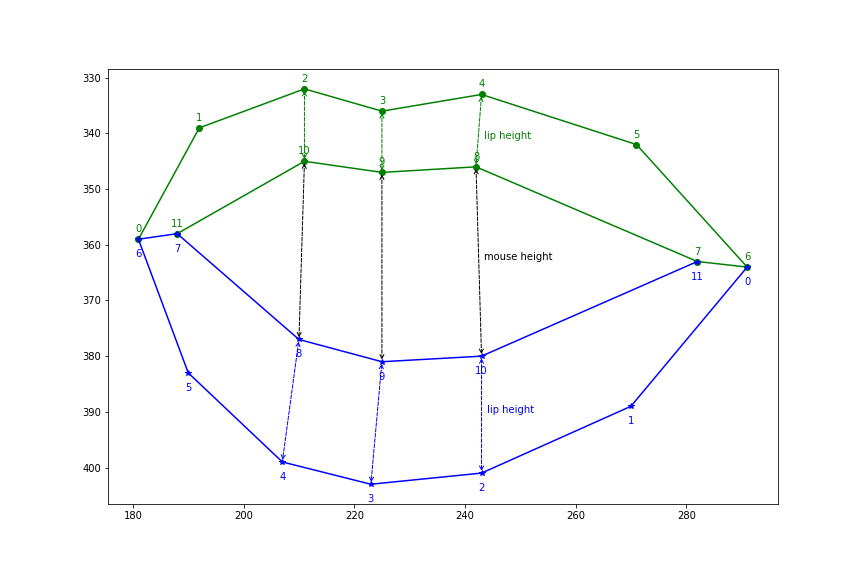
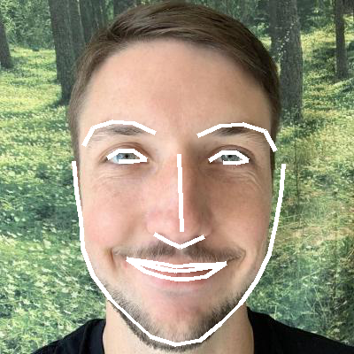

# Overview
Deployments can be complicated and stressful. Tools such as Terraform and Pulumi can make deploying cloud infrastructure easy. If you use terraform you can also leverage tfsec and terratest to iterate swiftly by scanning your code for security best practices and testing it between iterations.

This project uses Peter Jiping Xie's face_detection algorithm. I repurposed it to count your breathing, and after six breaths it runs a function that prints out to the console, but it could easily be configured to run a terraform plan as the example shows.

Six breaths is chosen because it has been shown to deactivate the fear center of the brain and 'calm the circuits'. This is particularly useful to do any time when running a deployment so that you are centered, and focus for what you will do following the deployment(monitoring, validation using a smoke test, etc.).

# Project requirements
You need to install the software for running the facial recognition software. I was able to do the below setup. You may need to install missing dependencies. 
- Mac
- Webcam

# Project setup
```sh
# Create and source a python environment and then install the requirements
python3 -m venv env
source env/bin/activate
python3 -m pip install -r requirements.txt
```

# Run command and start inhaling through nose and exhaling through mouth to 'deploy'.
```
python3 breathe_to_deploy_cloud_infrastructure.py
```

## Console output from running
```
(env) josh at breathe_and_build_cloud_infrastructure 🌲 python3 breathe_to_deploy_cloud_infrastructure.py
{'chin': [(545, 102), (551, 142), (557, 180), (565, 217), (579, 249), (605, 271), (637, 285), (671, 295), (705, 299), (738, 296), (766, 282), (790, 262), (805, 232), (811, 198), (814, 163), (817, 128), (819, 92)], 'left_eyebrow': [(576, 38), (590, 10), (615, -7), (645, -8), (672, 3)], 'right_eyebrow': [(730, 3), (756, -5), (781, -3), (802, 13), (809, 42)], 'nose_bridge': [(706, 40), (709, 59), (712, 78), (715, 97)], 'nose_tip': [(682, 130), (697, 132), (710, 135), (721, 133), (732, 133)], 'left_eye': [(606, 62), (622, 48), (640, 47), (658, 60), (641, 63), (622, 65)], 'right_eye': [(738, 61), (756, 49), (773, 51), (786, 65), (774, 67), (756, 66)], 'top_lip': [(649, 195), (675, 174), (695, 165), (709, 168), (724, 165), (740, 177), (755, 200), (745, 197), (723, 184), (709, 184), (695, 183), (660, 193)], 'bottom_lip': [(755, 200), (739, 207), (723, 207), (708, 206), (694, 206), (673, 202), (649, 195), (660, 193), (694, 186), (708, 188), (723, 188), (745, 197)]}
top_lip_height: 17.68, bottom_lip_height: 19.00, mouth_height: 3.76, min*ratio: 8.84
Breath number: 0
...
Breath number: 1
...
Breath number: 5
{'chin': [(547, 96), (554, 137), (560, 178), (568, 216), (583, 249), (611, 274), (645, 290), (681, 301), (715, 304), (746, 300), (772, 285), (792, 263), (805, 232), (811, 196), (814, 160), (818, 125), (819, 91)], 'left_eyebrow': [(591, 29), (608, 4), (632, -10), (660, -11), (686, -2)], 'right_eyebrow': [(747, 0), (768, -7), (789, -5), (807, 8), (813, 32)], 'nose_bridge': [(719, 42), (723, 60), (728, 77), (732, 96)], 'nose_tip': [(698, 132), (712, 134), (725, 136), (735, 134), (745, 132)], 'left_eye': [(620, 59), (636, 46), (654, 46), (670, 60), (654, 63), (636, 64)], 'right_eye': [(748, 62), (765, 50), (782, 52), (793, 66), (782, 69), (765, 67)], 'top_lip': [(665, 202), (688, 174), (709, 162), (723, 165), (737, 162), (754, 177), (765, 204), (757, 202), (736, 182), (722, 181), (708, 181), (675, 200)], 'bottom_lip': [(765, 204), (753, 218), (736, 223), (722, 223), (707, 222), (686, 215), (665, 202), (675, 200), (708, 201), (722, 203), (736, 203), (757, 202)]}
top_lip_height: 18.36, bottom_lip_height: 20.34, mouth_height: 21.00, min*ratio: 9.18
Breath number: 6

Running code:

terraform init -input=false
terraform apply -input=false -auto-approve
```

# Links
- https://towardsdatascience.com/how-to-detect-mouth-open-for-face-login-84ca834dff3b
- https://github.com/ageitgey/face_recognition
- https://gist.github.com/ageitgey/629d75c1baac34dfa5ca2a1928a7aeaf
- https://towardsdatascience.com/how-to-detect-mouth-open-for-face-login-84ca834dff3b
- Check this [Medium post](https://towardsdatascience.com/build-face-recognition-as-a-rest-api-4c893a16446e?source=friends_link&sk=5b89a9cbfc997aee59743c504c3bf068) for more details.
- Install [face_recognition](https://github.com/ageitgey/face_recognition.git) package first.
- A simple algorithm to detect mouth open utilizing feature outputs from face_recognition project. Check this [Medium post](https://towardsdatascience.com/build-face-recognition-as-a-rest-api-4c893a16446e?source=friends_link&sk=5b89a9cbfc997aee59743c504c3bf068) for more details.

## Algorithm
Mouth points and measurements:



# Generate facial features for an image.
```
python3 find_facial_features_in_picture.py
```

Corresponding facial features for Obama:


Corresponding facial features for Josh:



## Future thoughts

1. Using this at a company in the wild across multiple platforms I would recommend running it in a container with all of the dependencies present, so that it isn't a cross platform headache that is supposed to 'calm' you down, but you question if it is going to work every time.
2. If the webcam and input could be secured this would be an interesting way to biometrically approve code execution, such as using Apples FaceID and a multifactor authentication app like Authy. 
3. I am going to make more things like this. It was fun.